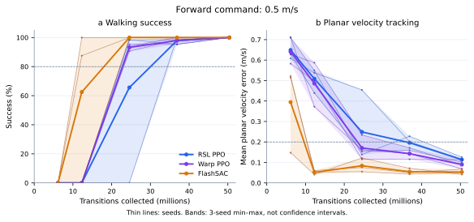
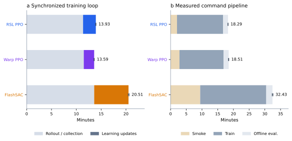

# G1 learning: sample efficiency and training speed

Nine fresh runs compared stock RSL-RL PPO, matched Warp PPO, and the authors'
FlashSAC code recipe on `Isaac-Velocity-Flat-G1`. Each used 1,024 environments,
a 24-step rollout, 2,050 iterations, and **50,380,800 collected transitions**.
Seeds 0, 1, and 2 ran on isolated NVIDIA L40 GPUs.

## Results

Three-seed means; velocity error is from the final fixed 0.5 m/s forward evaluation.

| Learner | Production training loop | Learning phase | Planar error ↓ | Native-command survival ↑ |
|---|---:|---:|---:|---:|
| RSL PPO | 835.85 s | 154.17 s | 0.114 m/s | 87.50% |
| Warp PPO | 815.66 s | 125.50 s | 0.090 m/s | 99.48% |
| FlashSAC | 1,230.80 s | 414.66 s | 0.053 m/s | 100% |

All nine final policies achieved 100% walking success and survival in the
forward evaluation. FlashSAC's first observed passing checkpoints were
500/500/1000 iterations, versus 1000/1500/1000 for Warp and 1000/1000/2050 for RSL.
At 12.288M transitions, Flash passed in two seeds; neither PPO passed yet.
Checkpoints are sparse observations, not exact convergence times. RSL seed 0
passed at 1000, failed at 1500, and passed again at 2050.



Thin lines show individual seeds; the band is their range, **not a confidence
interval**. Each point evaluates 64 worlds. Lines only connect measured checkpoints.

Warp's learning phase was 1.228× faster, but the complete loop was only 1.025×
faster: rollout consumed about 82–85% of PPO's time. Flash performed more replay
updates with larger networks; better observed sample efficiency coexisted with
slower full-budget training.



The required smoke, training process, and common evaluations totaled
**1,097 / 1,110 / 1,946 seconds** for RSL / Warp / Flash. These exclude container
bootstrap, queueing, and retrieval, and retain caches between smoke and training.
Warp had no overall command-pipeline speed advantage here. Flash's phase split
uses CUDA events, while PPO uses synchronized wall timing; phase totals are not
a comparison of equal gradient work.

## What is included in RoboLearn?

RoboLearn 0.2 contains the learner code used for these results: native PPO math
options, tiled Warp Linear gradients, deferred device metrics, and stable tensor
ownership across compiled FlashSAC sampling calls. The measured library revision
is [`dc772f9`](https://github.com/maxkra15/RoboLearn/tree/dc772f9d65c21441c9bdb70ed905557074e00f7e).
The post-benchmark update adds documentation, versioning, focused CPU regression
coverage, and an adapter fix that freezes unclipped action tensors in saved
transitions. The fix adds one device copy per unclipped adapter step; no new
runtime measurement is claimed. The learner math and optimized kernels are unchanged.

Task registrations and the native train/play runners live in the
[Isaac Lab integration branch](https://github.com/maxkra15/IsaacLab/tree/experiment/g1-learning-baselines).
The library does not install a simulator or experiment service. RSL-RL remains
the external stock PPO reference.

## Reproduce the frozen comparison

Install the supported Isaac Lab stack using its documentation. The following
checkout locks the experiment dependencies, including the measured RoboLearn:

```bash
git clone --branch experiment/g1-learning-baselines \
    https://github.com/maxkra15/IsaacLab.git
cd IsaacLab
git checkout 734ad065e13c33d564ff86e1a22a138ce678c781
uv sync --frozen --extra robolearn --python 3.12.14

export OMP_NUM_THREADS=8
export MKL_NUM_THREADS=8
export OPENBLAS_NUM_THREADS=8
export PXR_WORK_THREAD_LIMIT=1
```

This lock installs RoboLearn `dc772f9`; a separate unpinned install would change
the reproduction. Recorded versions: Torch 2.12.0+cu130, Warp 1.17.0,
Warp-NN 0.4.0, Newton 1.6.1, ordinary MuJoCo Warp 3.12.0, and RSL-RL 5.5.1.
Each cloud allocation had 15 CPUs and 64 GiB RAM. Use one isolated GPU for each
concurrent run, or train sequentially on one GPU.

```bash
uv run --no-sync python scripts/benchmarks/run_g1_learning_baselines.py train \
    --output logs/g1-rsl-seed0 --algorithm rsl_rl_ppo \
    --seed 0 --num_envs 1024 --iterations 2050 \
    --checkpoint_iterations 250 500 1000 1500 2050

uv run --no-sync python scripts/benchmarks/run_g1_learning_baselines.py train \
    --output logs/g1-warp-seed0 --algorithm warp_ppo \
    --seed 0 --num_envs 1024 --iterations 2050 \
    --checkpoint_iterations 250 500 1000 1500 2050 \
    --train_override agent.algorithm_cfg.optimized_linear_backward=true

uv run --no-sync python scripts/benchmarks/run_g1_learning_baselines.py train \
    --output logs/g1-flash-seed0 --algorithm flashsac \
    --seed 0 --num_envs 1024 --iterations 2050 \
    --checkpoint_iterations 250 500 1000 1500 2050

for run in logs/g1-rsl-seed0 logs/g1-warp-seed0 logs/g1-flash-seed0; do
    uv run --no-sync python scripts/benchmarks/run_g1_learning_baselines.py evaluate \
        --output "$run" --eval_envs 64 \
        --checkpoint_iterations 250 500 1000 1500 2050 \
        --scenarios native_commands forward_0_5 --foot_contacts
done
```

Repeat with seeds 1 and 2 and fresh output directories. The harness creates
fresh policies/optimizers, saves native checkpoints, and records exact budgets
and timing. The [native CLI guide](isaaclab.md) covers ordinary training outside
the measurement harness.

## Recipes that matter

- **PPO:** ELU networks 256/128/128, scalar Gaussian standard deviation,
  five epochs × four minibatches, adaptive learning rate 0.001 at target KL 0.01,
  entropy 0.008, full-MSE value loss, separate gradient clipping, and native
  timeout/advantage conventions. Preserve raw Gaussian actions with
  `clip_actions=None`. Warp explicitly enables `optimized_linear_backward=True`.
  The [Warp guide](warp.md) explains the numerical conventions.
- **FlashSAC:** 10M replay, 100K warmup, batch 2,048, three-step returns,
  two critic updates per vector step, actor update every two critic updates,
  AMP, Torch compilation, and a 98,400-call learning-rate decay budget.
  Aggregate detached tensor metrics before converting to host scalars at
  logging boundaries. Preserve owned sampling tensors across compiled calls.
- **Both:** randomize initial episode counters. This was already native PPO
  behavior; the corrected Flash registration sets `init_at_random_ep_len=True`.
  Rewards, observations, commands, action scale, resets, and terminations match.

Generic library defaults are preserved. Changing a backend name alone does not
select these numerical settings. Keep compilation/capture work outside logging
and measure the full workload before making a speed claim.

## Evaluation and limits

The manager MDP remains **Torch eager**; Newton MJWarp physics and the learner
use separate graphs. This is not a fully captured Warp environment or a
differentiable-physics experiment.

Common evaluation uses deterministic actions, 64 worlds, full 20-second
episodes, no observation noise or pushes, and native reset randomization.
The evaluation seed is 10000 + training seed. Checkpoints are evaluated under
native commands and a fixed forward command of 0.5 m/s.

The forward gate requires at least 80% walking success, mean planar error
≤ 0.2 m/s, and survival ≥ 90%. A walking world survives with planar error
< 0.25 m/s, yaw-rate error < 0.4 rad/s, and forward speed > 0.25 m/s.
Native commands include standing, so native tracking success is a different metric.
Contact traces show repeated contacts but asymmetric support duty for Flash;
these measures do not certify a natural or hardware-ready gait.

These three seeds are descriptive evidence. Flash uses bounded actions, AMP,
distributional critics, and about 15× more parameters than PPO; identical MDPs
and collection budgets do not mean identical policy support, compute, or RNG draws.
The FlashSAC paper used Isaac Lab 2.1/PhysX and a different PPO budget. This is
an Isaac Lab 3/Newton integration benchmark using the authors' code recipe,
not an exact paper replication or its separate real-robot experiment.

All native checkpoints and raw JSON were preserved and independently audited
for SHA256 integrity, finite updated weights, budgets, and common evaluations.
Earlier Flash runs with different initial episode counters remain diagnostics;
they are excluded from the nine-run primary comparison.

## Attribution

FlashSAC is the work of Donghu Kim, Youngdo Lee, and their coauthors:
[paper](https://arxiv.org/abs/2604.04539) and
[official code](https://github.com/Holiday-Robot/FlashSAC/tree/87edc9061150ae9e962dd84e6544e27a1554b3ab).
PPO is due to John Schulman, Filip Wolski, Prafulla Dhariwal, Alec Radford,
and Oleg Klimov: [paper](https://arxiv.org/abs/1707.06347).
See [full attribution](../ATTRIBUTION.md) and [citations](../CITATIONS.bib) for
all authors and dependency credits, including RSL-RL and NVIDIA Warp-NN.
